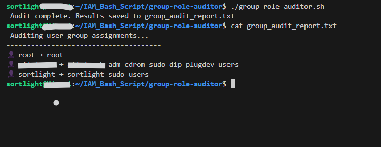

#  Group & Role Auditor  
**Because every user shouldn't be in the sudo club.**

---

##  What This Script Does

This Bash script performs a lightweight audit of your system’s **user → group assignments** to help you identify:

- Users with elevated roles
- Orphaned accounts with unnecessary access
- Security misconfigurations in `/etc/group`

---

## Features

- Lists all users with a valid login shell
- Shows every group they belong to
- Saves output to `group_audit_report.txt`
- Helps enforce least privilege principle

---

Check the results in:

``` Bash
       cat group_audit_report.txt

```
## Why It Matters

 In IAM, it's easy to forget who has access to what. This tool provides clarity — exposing who belongs to sudo, docker, or admin groups so you can trim back unnecessary privilege.

 ## Demo Output



## Skills Showcased

   Parsing /etc/passwd securely

   Using id -nG for clean group lookup

   Bash scripting best practices

   Access auditing and IAM governance

## Devotion to Digital Stewardship
    
   “To whom much is given, much will be audited.” – SortSec


This script is a checkup tool which is a diagnostic for IAM hygiene. It’s how I put watchfulness into code. Every entry in a group is a trust. Let’s audit it.


## Credit

Crafted with purpose by [Sortsec](x.com/sortsec)

Bless the builders, guard the gates


